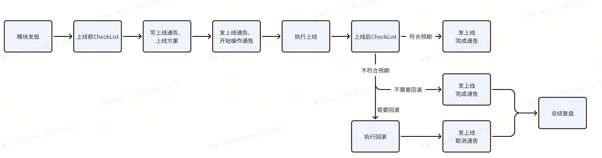

1. 上线整体流程
   

   上述流程中上线结果不符合预期时，如果对服务可用性没有影响，那么不是必须回滚，比如以下情况：
- 上线了性能优化但效果不如预期，后续可以继续优化
- 非常小的问题或错误，可以在迭代中修复
- 界面的细节展示问题
  是否回滚要具体情况具体分析。
  出现不符合预期的情况时，必须总结后在组内同步，严重的问题则需要单独复盘。

2. 上线前 CheckList
   在上线操作前过一遍以下问题，思考是否已做好了万全的准备。

2.1 是否在线下做好了测试
不管是新 feature、性能优化、bugfix，都需要在线下充分测试后再上线。

2.2 是否有外部依赖需要改动
确认是否涉及到外部的依赖项，若涉及那么依赖是否已完成相应的改动，比如：
- MySQL 是否需要增加字段
- 是否有要修改的 ConfigMap
- 依赖的其它服务是否已经 Ready

2.3 模块兼容性与上线顺序
- 本次只上线一个模块
    - 是否改变了接口/返回，是否与上下游兼容
- 本次上线多个模块
    - 是否改变了接口/返回，是否与上下游兼容
    - 模块间是否有依赖关系，若有上线顺序是什么

2.4 上线后如何观测验证
- 是否需要手动操作来验证
- 除了系统黄金指标，还需要重点观察哪些关键指标
- 是否需要新增 Prometheus 指标面板
- 有哪些关键日志需要查看

2.5 是否有回滚方案
- 是否需要回滚（比如性能优化结果没到预期、未开放的新功能异常，不需要回滚）
- 是否做好了回滚的准备
    - 改动是否支持回滚，是否兼容老版本，是否产生脏数据
    - 如何执行回滚
    - 老版本的配置、YAML 等是否备份了

蓝绿部署：faasapi，在融合云操作升级和回滚
滚动升级：fission-agent，Fission Router，Fission Executor，通过 kubectl apply 旧的 YAML 来回滚

3. 上线中的操作规范
   3.1 按线上环境分阶段上线
   按照北京 dev/test/ontest -> 苏州 prod -> 北京 prod 的顺序上线，前一个环境验证无误后再上线后一个环境。
   多个环境在一天内全部上线还是分多天上线，根据上线模块、复杂度、风险度来定，不硬性规定。

3.2 操作发通告
- 上线前通告，至少提前 10 分钟发出
- 上线开始通告
- 上线完成通告
- 若回滚则发上线取消通告
  通告发出到「函数平台运营群」，目前 faasapi 模块已结合飞书项目实现了自动通报，其它模块还需要通过罗伯特在函数平台运营群通告）
  通告要求：
1. 包含面向用户的功能说明
2. 包含面向函数平台研发人员的验证、回滚等方案说明
   一个罗伯特通告示例，【变更内容】是 1，【操作文档】是 2， 即上线方案文档的链接
   操作文档模板：https://li.feishu.cn/docx/QlItdYPJLo5BYTxgns9ch0oEnPe
   【变更背景】    23Q3-01迭代上线
   【变更部门】    研发服务平台
   【变更级别】    低级
   【执行时间】    2023-08-22 10:00:00
   【执行时长】    1小时30分钟
   【通知发起人】   闫勃
   【操作人】      闫勃
   【验证人】      王晓娟
   【操作对象】    faas-api,serverless-ui
   【操作文档】    https://li.feishu.cn/docx/QlItdYPJLo5BYTxgns9ch0oEnPe
   【影响范围】    上线期间，融合云3.0服务无影响
   【变更内容】    
   【函数平台 】函数管理 - 函数配置 - 修改
   【函数平台 】函数管理 - 函数代码 - IDE
   【函数平台 】函数管理 - 函数部署
   【函数平台 】函数管理 - 触发器(不包含MQ类)
   【函数平台 】函数管理 - 函数配置 - 信息展示
   【函数平台 】函数列表
   【函数平台 】接入 licloud 的租户与权限
   【函数平台 】函数创建
   【函数平台 】老平台租户关联弹窗

流程引擎如何通告，是否有独立的运营群？
3.3 具体操作
- 直接使用 kubectl apply 变更时，反复确认集群信息和文件内容后再执行；推荐使用 kube-ps1，在命令行操作 K8s 集群时能显示集群名称，降低误操作概率
- 对没把握的操作，可找其他同学 Double Check

4. 上线后 CheckList
- Pod 状态是否正常，ConfigMap/Environment 等配置文件内容是否正确
- 改动内容是否已验证通过，不限于手动验证或冒烟测试
- 系统黄金指标、改动涉及的关键指标、关键日志，是否都已经观察、无异常
- 即便上线当天无异常，在随后的两天内，也需要每天抽时间观察黄金指标、留意报警
- 上线时若出现问题，处理后及时总结复盘，将结论同步给组内同学

4.1 异常处理
上线后发现异常了怎么处理
- 日志异常、指标出现较大波动、非预期值、或有报警时，即便看起来跟你的改动没关系，务必重视不抱侥幸心理，99%跟上线有关
- 发现功能不符合预期或者服务异常时，第一时间在函数计算研发群内通告到组内同学和直属领导
- 异常影响到服务可用性时，遵循「先止损、后定位」的原则，优先通过回滚恢复服务
- 回滚后，需要继续观察服务是否恢复

5. 上线周期与时间
   5.1 上线周期
   过长的上线周期：对较早的改动会淡忘；容易积累出较多的改动，从而增加风险
   过短的上线周期：频繁操作，增加负担
- 较为频繁的模块：faasapi，两周上线一次。若有要立刻修复的线上 bug 则可立刻上线，原有迭代继续以两周的周期进行
- 不频繁改动的模块：fission-agent/Router/Executor，不按照固定节奏，测试通过后一周内上线
- 遇到因产品发布会等情况导致的上线管控，根据情况提前或顺延

5.2 上线时间
推荐：
- 优先选择每周的周二，在本周内有充足的观察、问题修复时间，次优周三，再次优周四
- 优先在上午上线，最迟下午 4 点前上线

不推荐：
- 不推荐在周一或节假日后的第一天上线：不在最佳的工作状态；经过假期后对改动内容会有所淡忘
- 不推荐在周五或节假日前的最后一天上线（尤其是新上线）：可能在假期内出现问题，不能及时处理
- 不推荐在有特殊情况时上线（可酌情评估）：
    - 所涉及模块的关键研发人员休假：不能及时协助
    - 重大上线、跨团队上线时直属领导休假：不能及时协调资源
    - 当天部门关键服务（网络、安全、融合云）已经出现了较大故障时

6. 指导原则
- 对线上抱有敬畏之心，一次随意的上线可能造成严重的问题，每次故障都会降低用户对我们的信任
- 严格遵守上线规范，上线问题不可避免，在遵守规范的前提下即便出现问题也是免责的；偷偷上线、夹带私货，即便没造成问题，也要批评
- 牢记「先止损、后定位」的原则
- 情况不确定时、不知所措时及时求助，我们鼓励求助
