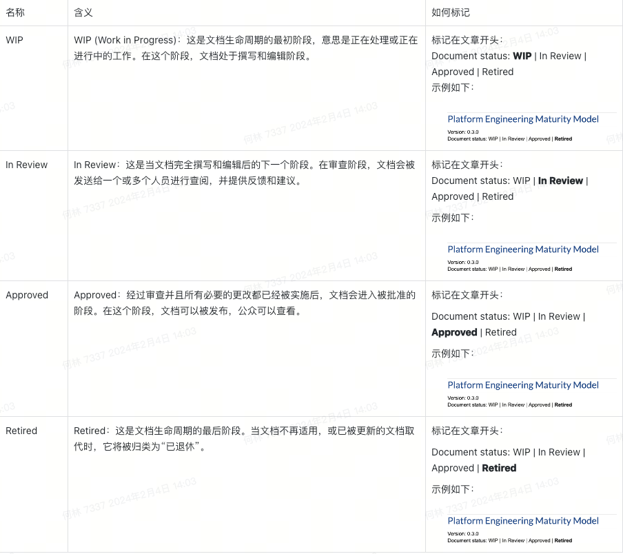

基本原则
- 同理心：
    - 尊重：避免宣称某步骤「很容易」、「很简单」，不要无意中冒犯用户
    - 结构：用要点代替或引出背后完整的描述，保证用户能高效地获取信息
    - 方便：想快速上手、想了解原理、想开发对接的用户都能找到对应内容
    - 精简：尊重奥卡姆剃刀原则，如果删除掉不影响内容表达就果断地删除
    - 完整：公开的内容需保证完整性，但不必保证系统的所有功能都文档化
    - 验证：任何的功能演示、上手教程中的案例必须想办法验证可行才上线
    - 溯源：如果文档的内容来源于某项资料，需要在结尾给出参考文献列表
- 一致性：
    - 术语：特殊名词不擅自发挥，尊重统一的表达
    - 风格：表达风格尽量一致，不要有太大的反差
    - 时效：没有文档比有但是已经过期的文档更好
    - 结构：根据文档的类别来选择合理的叙事结构
      单篇文档
      状态
      根据文档的编写阶段，可以分为以下 4 个状态：
      名称
      含义
      如何标记
      WIP
      WIP (Work in Progress)：这是文档生命周期的最初阶段，意思是正在处理或正在进行中的工作。在这个阶段，文档处于撰写和编辑阶段。

标记在文章开头：
Document status: WIP | In Review | Approved | Retired
<p align="center"><a href="http://www.boblog.com" target="_blank" rel="noopener noreferrer"></a></p>


格式
标题
- 标题级别：从 H1 开始依次使用多级标题，标题级别不跳跃
- 标题序号：如果要在标题上加序号，请使用文档标题编号，不用中文数字
  文本
- 汉字与英文字母之间添加空格
- 汉字与阿拉伯数字之间添加空格
- 使用「」代替中文引号（在中文打字法下用 shift + [ 和 shift + ]输入）
- 文本中的变量使用 ${} 来表示，如 run.${env}.sh
  名词
  一些特殊名词请保持与附录规定的一致。
  列表
  使用英文句号：
1. Foo
2. Bar
3. Baz
   不使用中文顿号：
   1、Foo
   2、Bar
   3、Baz
   列表项尾部不加标点。
   代码
   过长的代码尽量通过一些方式转换成可读性更高的形式，如：
```bash
curl -XPOST -H "Content-Type: multipart/form-data" \
   -F "image=@/path/to/origin/image.png" \
   -F "text=faas" \
   --output output.png 
```
   
   图片

   对齐

   对称

   居中

   紧凑

   断句
   
   高亮块:
   高亮块由一个 emoji 表情和文字构成，这里限定几个通用场景下应该使用的表情：
   公告或通知请使用白色大喇叭
   需要用户等待请使用沙漏
   需要用户特别关注、必须注意的内容请使用红色感叹号
   引人思考的观点、想法请使用灯泡
   一般提示信息、补充信息，请使用红色图钉
   用户按照教程或文档提示完成了某个任务，请使用礼花
   其它场景文档撰写者可自行取舍。本文对高亮块的颜色暂无规定，无特殊情况建议使用默认颜色。
   具体操作方法可参考飞书帮助中心的在文档中插入高亮块

   排版: 存在并列关系的内容，可以考虑多列排版，提升用户的信息获取效率

   工具
- 落地页：快速导航、分类导航、补充导航
- 分级页：快速导航
  类似超市、景区的游览示意图和路标。
  分类
  根据访问者的身份类别：
- 用户：只想知道怎么上手用
- 开发：想深入了解工作原理
  根据文档的类别：
- 快速上手
- 基本概念
- 架构设计
- API 文档
- ...

  引用
  引用的内容越精确越好。

  附录

  名词与术语

  基本规则

  对象

  规则

  特殊名词

  首字母大写 + 驼峰

  Prometheus、GitLab、GoLand

  缩写

  全大写，英文介词或单词的非首字母小写

  GPT、APP、CLI、OKR、HTTP、FaaS、SaaS、OTel

  略写
  首字母大写 + 中间字母数量 + 尾字母小写
  K8s、A16z、O11y、A11y

  本规则并非绝对，少数情况下社区中可能已经形成使用习惯，这时候建议与社区保持一致，如 n8n、gRPC。

参考文献
- WriteTheDocs
- 飞书文档使用手册：云文档
- 字节跳动优秀文档 8 大秘籍
- ✅  写好文档检查清单
- Don't Say Simply
- Thinking in content levels
